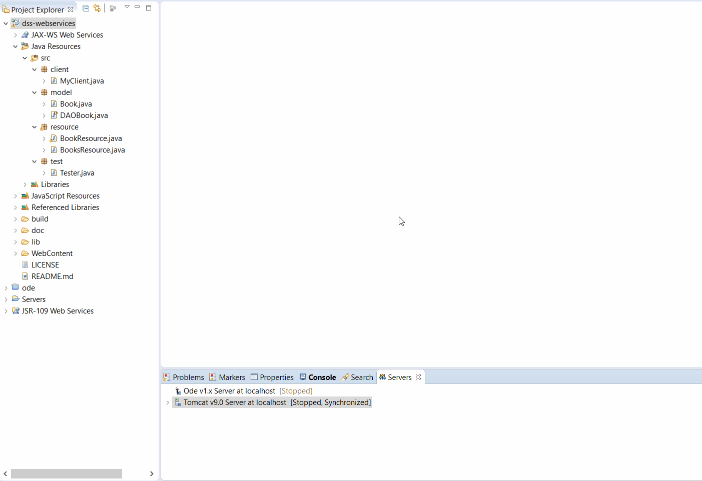
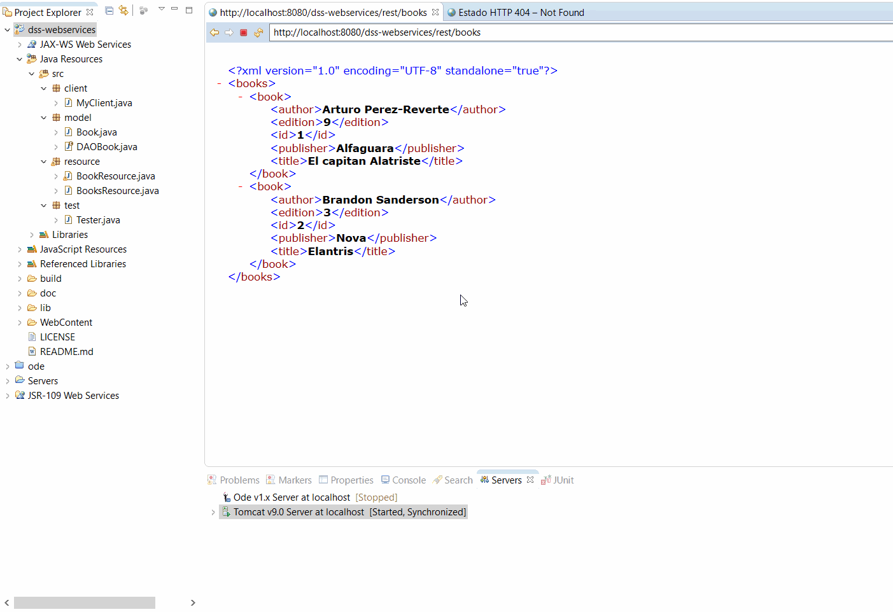
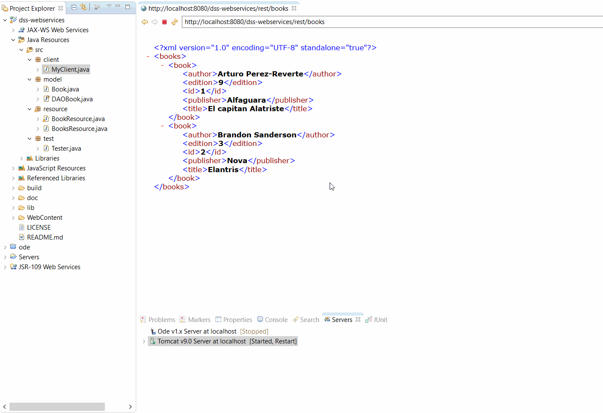
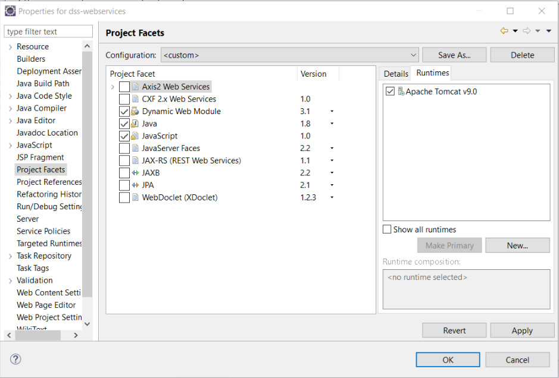

# Overview
Demo project using [Apache Jersey](https://jersey.github.io/) for creating a RESTful API for managing books, deploying it on an [Apache Tomcat 9](http://tomcat.apache.org/) server and testing all HTTP methods with JUnit.

> HTTP methods are used to map CRUD (create, retrieve, update, delete) operations to the HTTP requests PUT, GET, POST and DELETE .

# Showcase
## Launching project and viewing books on web browser


## Adding books through web form


## Testing CRUD operations


# Installation
* Import to Eclipse as _Existing project_
* Make sure _Project>Properties>Project_ facets corresponds with the image bellow.

* Make sure ```Jersey``` libraries on _WebContent/WEB-INF/lib/_ are included on the build path.
* Make sure ```JUnit``` libraries on _lib/_ are included on the build path.

# Execution
See [Showcase](https://github.com/gomezportillo/dss-webservices#showcase) or
* Project > Run as... > Run on server > Apache Tomcat server.
* Access to ```http://localhost:8080/dss-webservices/rest/books``` for getting all books like the following:
```XML
<books>
    <book>
      <author>Arturo Perez-Reverte</author>
      <edition>9</edition>
      <id>1</id>
      <publisher>Alfaguara</publisher>
      <title>El capitan Alatriste</title>
    </book>
    <book>
      <author>Brandon Sanderson</author>
      <edition>3</edition>
      <id>2</id>
      <publisher>Nova</publisher>
      <title>Elantris</title>
    </book>
</books>
```
* [MyClient.java](src/client/MyClient.java) > Run as... > Java application for testing CRUD oprations. It will generate an output like the following.

```
======TESTING SERVER IS UP======
HTTP code after accessing server (expected 200): 200

======TESTING GETTING ALL BOKS======
Getting all books in server:
<?xml version="1.0" encoding="UTF-8" standalone="yes"?><books><book><author>Arturo Perez-Reverte</author><edition>9</edition><id>1</id><publisher>Alfaguara</publisher><title>El capitan Alatriste</title></book><book><author>Brandon Sanderson</author><edition>3</edition><id>2</id><publisher>Nova</publisher><title>Elantris</title></book></books>

======TESTING GETTING SINGLE BOOK======
Response after getting book with index=1:
<?xml version="1.0" encoding="UTF-8" standalone="yes"?><book><author>Arturo Perez-Reverte</author><edition>9</edition><id>1</id><publisher>Alfaguara</publisher><title>El capitan Alatriste</title></book>

======TESTING POSTING NEW BOOK======
HTTP code after posting book (expected 200): 200
List of books DOES contain new posted book

======TESTING DELETING POSTED BOOK======
HTTP response code after deleting a book (expected 204): 204
List of books DOES NOT contain previous posted book

======TESTING PUTTING BOOK======
HTTP response code after adding a book (expected 204): 204
List of books DOES contain previous put book

======TESTING UPDATE BOOK======
<?xml version="1.0" encoding="UTF-8" standalone="yes"?><books><book><author>Arturo Perez-Reverte</author><edition>9</edition><id>1</id><publisher>Alfaguara</publisher><title>El capitan Alatriste</title></book><book><author>Brandon Sanderson</author><edition>3</edition><id>2</id><publisher>Nova</publisher><title>Elantris</title></book><book><author>George R.R. Martin</author><edition>4</edition><id>4</id><publisher>Gigamesh</publisher><title>Juego de tronos</title></book></books>
List of books DOES contain updated book
```
